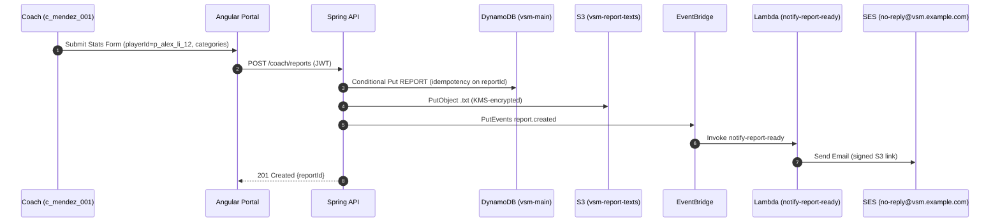

# Sequence Diagram — Coach Sends Stats (Manual)

```mermaid
sequenceDiagram
  autonumber
  participant Coach as Coach (c_mendez_001)
  participant Angular as Angular Portal
  participant API as Spring API
  participant DDB as DynamoDB (vsm-main)
  participant S3 as S3 (vsm-report-texts)
  participant EB as EventBridge
  participant L as Lambda (notify-report-ready)
  participant SES as SES (no-reply@vsm.example.com)

  Coach->>Angular: Submit Stats Form (playerId=p_alex_li_12, categories)
  Angular->>API: POST /coach/reports (JWT)
  API->>DDB: Conditional Put REPORT (idempotency on reportId)
  API->>S3: PutObject .txt (KMS-encrypted)
  API->>EB: PutEvents report.created
  EB->>L: Invoke notify-report-ready
  L->>SES: Send Email (signed S3 link)
  API-->>Angular: 201 Created {reportId}
```
